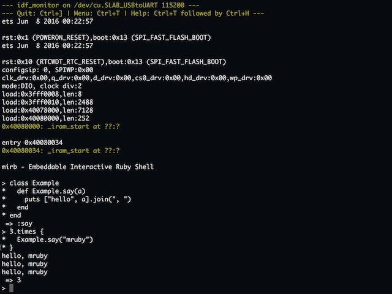

# mruby-esp32-app-mirb

mirb (Embeddable Interactive Ruby Shell) pour ESP32.
[English version](README.md)



Ce projet fait référence à [carsonmcdonald/mruby-esp32](https://github.com/carsonmcdonald/mruby-esp32), mille merci.

## Compiler avec ESP-IDF

0) Préparer la chaine de build ESP-IDF est un prérequis [ESP-IDF](https://github.com/espressif/esp-idf). Merci de vous assurez que cela fonctionne avant de passer à la suite.

1) cloner le code

	```
	$ git clone --recursive https://github.com/mruby-esp32/mruby-esp32-app-mirb.git
	$ cd mruby-esp32-app-mirb
	```

2) Définir le port série.

	```
	$ make menuconfig
	```

	`Serial flasher config` > `Default serial port` > `/dev/cu.xxx`
  
3) Compiler

	```
	$ make
	```

> *Note: En cas de mise à jour de ESP-IDF et de changement du sdkconfig, veuillez definir `CONFIG_FREERTOS_UNICORE=y`.*

## Flash & Connexion au port série.

```
$ make flash monitor
```

démarrer mirb, REPL (Read–eval–print loop)


## Configuration

pour ajouter des gems mruby editer `components/mruby/build_config.rb`.

```ruby
MRuby::CrossBuild.new('esp32') do |conf|

  # ...(code)...

  # exemple ajout du gem wifi
  conf.gem :github => "mruby-esp32/mruby-esp32-wifi"
  # ajout du gem de gestion gpio
  conf.gem :github => 'mruby-esp32/mruby-esp32-gpio'

end
```
